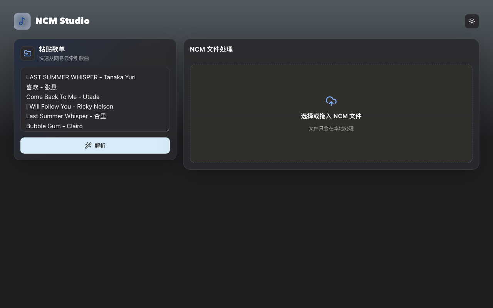

# NCM Studio

NCM Studio 是一个浏览器和 CLI 均可使用的本地 `.ncm` 文件处理工具。它的目标很朴素：方便把自己已经拥有或有权使用的歌曲原文件整理出来，放到自己的离线设备里，比如游泳用的运动耳机、车载播放器、随身播放器等。

请勿将本项目用于侵犯版权、规避付费、批量搬运、传播未授权音乐或其他违法用途。

## 在线示例

- 在线站点：https://ncm.mikeywa.icu
- npm：https://www.npmjs.com/package/ncm-studio-cli
- GitHub 仓库：https://github.com/yanghaoleng/ncm-studio



## 适合的使用场景

- 你已经有一批本地 `.ncm` 文件，希望在浏览器里转成可播放的音频文件。
- 你想把自己有权使用的音乐文件拷贝到离线设备里，例如游泳运动耳机。
- 你希望文件处理尽量在本地浏览器完成，不把本地音乐文件上传到应用服务器。
- 其他音乐平台推荐使用[网易官方歌单导入工具或 CLI](https://music.163.com/st/ncmcli#setup)快速创建歌单。

## 功能

- 拖入或选择本地 `.ncm` 文件。
- 在浏览器本地解析和转换 `.ncm` 文件。
- 尽可能读取元数据和内嵌封面。
- 为 MP3 写入 ID3 标题、歌手、专辑和 `APIC` 封面信息。
- 单首下载或把已完成的本地转换结果打包成 ZIP。
- 大批量 ZIP 打包使用百分比进度；进度长时间不变或生成失败时，会提示重试或分批处理。
- 响应式界面，适配桌面和移动端。
- CLI 支持单文件、目录递归、进度、重名保护和 JSON 机器输出。

## CLI 安装

需要 Node.js 20 或更高版本。

```bash
npm install -g ncm-studio-cli
```

也可以不全局安装，直接运行：

```bash
npx ncm-studio-cli --help
```

## CLI 用法

```bash
# 转换一个目录，会递归查找 .ncm
ncm-studio convert ./music --output ./converted

# 转换单个文件
ncm-studio ./song.ncm -o ./converted

# 完全离线，不请求缺失的网络封面
ncm-studio ./music --no-network
```

常用选项：

- `-o, --output <目录>`：输出目录，默认 `./converted`。
- `--overwrite`：覆盖同名输出；默认会添加 `(2)` 等后缀。
- `--no-network`：不请求缺失的封面，内嵌封面仍会写入 MP3。
- `--json`：在 stdout 输出结构化结果，便于 AI 和脚本调用。
- `--quiet`：不显示人类可读进度。

## 供 AI 和自动化调用

推荐让 AI Agent 执行带 `--json` 的命令：

```bash
ncm-studio convert ./input --output ./output --json --no-network
```

stdout 只输出一个 JSON 对象，其中包含 `ok`、`total`、`succeeded`、`failed`、`files` 和 `errors`。全部成功时退出码为 `0`；参数、输入或部分转换失败时为 `1`。

CLI 不需要 API 密钥，也不会上传音频文件。默认可能会根据 NCM 元数据请求缺失的封面；自动化环境可使用 `--no-network` 禁用该请求。

## 隐私与本地处理

- 本地 `.ncm` 文件只在浏览器里处理，不会上传到应用服务器。
- 应用不需要 AI 密钥，也不会把歌单、元数据或音频发送给应用服务器。

## 大批量 ZIP 打包

- MP3/FLAC 等音频本身已经压缩，ZIP 显式使用 `STORE` 模式，不做无效的二次压缩。
- 每首歌转换完成时同步保存 CRC32；打包时直接组装标准 ZIP 文件头和中央目录，不再重读整批音频。
- 音频 Blob 会被原样引用到 ZIP Blob，避免再复制一份整包二进制数据。
- 按文件数量更新 0%-100% 进度；100 首以上会定期让出渲染帧，保持页面可响应。
- 20 秒没有进度变化时显示卡顿提示；异常会进入可重试的失败状态。
- 单个 ZIP 目前限制在 4 GB 以内。总体积过大时，请减少文件数量后分批处理。

## 合法使用声明

本项目仅用于个人整理、备份和使用自己有权处理的音乐文件。请遵守当地法律法规和音乐平台服务条款。

更详细的使用边界见 [使用与合规说明](docs/usage-and-legal.md)。

不要将本项目用于：

- 下载、传播或分享未经授权的音乐。
- 绕过会员、付费、DRM 或版权限制。
- 批量抓取、搬运或商业化分发音乐资源。
- 任何侵犯版权或违反平台规则的用途。

## 本地开发

```bash
npm install
npm run dev
```

本地试运行 CLI：

```bash
npm run cli -- --help
```

默认开发服务由 Vite 启动。根据终端输出打开对应本地地址。

## 构建

```bash
npm run build
```

## 测试

```bash
npm test
```

自动测试会验证 CLI 帮助、版本和 JSON 错误契约，也会验证 MP3 的 ID3 `APIC` 封面帧，并确认 ZIP 条目保留同一份带封面的音频数据。

## API

当前不包含应用服务端 API。文件解析、转换和打包均在浏览器或 CLI 本地执行。npm 包同时导出 `convertNcmFile(file, options)`，其中 `file` 需提供 `name` 和返回 `ArrayBuffer` 的 `arrayBuffer()`。

## 关键技术架构

- React + Vite 负责单页应用和响应式界面。
- `.ncm` 解析、音频转换、ID3 写入和 ZIP 打包均在浏览器本地完成。
- Node.js CLI 复用 `src/lib/ncm.js` 转换核心，不维护第二套解析逻辑。
- CLI 将进度写入 stderr，`--json` 结果写入 stdout，方便 Agent 稳定解析。
- `browser-id3-writer` 负责写入 MP3 ID3v2.3 文本标签与 `APIC` 封面帧。
- `src/lib/zip.js` 封装 CRC32、ZIP `STORE` 结构、Blob 组合、进度、重名保护和停滞检测。
- FileSaver 触发浏览器下载。

## 部署

项目可以部署到 Vercel。

## 技术栈

- React
- Vite
- FileSaver
- CryptoJS
- browser-id3-writer
- GSAP
- Lucide React

## 相关链接和参考

- 网易云音乐：https://music.163.com/
- 网易官方歌单导入工具与 CLI：https://music.163.com/st/ncmcli#setup
- ncmdump：https://github.com/taurusxin/ncmdump
- browser-id3-writer：https://github.com/egoroof/browser-id3-writer

## 致谢

本项目的 `.ncm` 解析和转换思路参考了社区公开格式知识，尤其是 [taurusxin/ncmdump](https://github.com/taurusxin/ncmdump)。请尊重原项目许可和贡献者。

## 免责声明

本项目不提供、存储或分发任何音乐文件。使用者需要自行确保拥有相关音乐文件或使用行为的合法授权。
